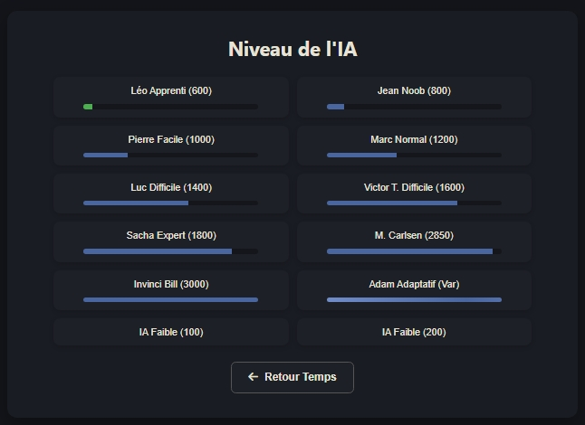
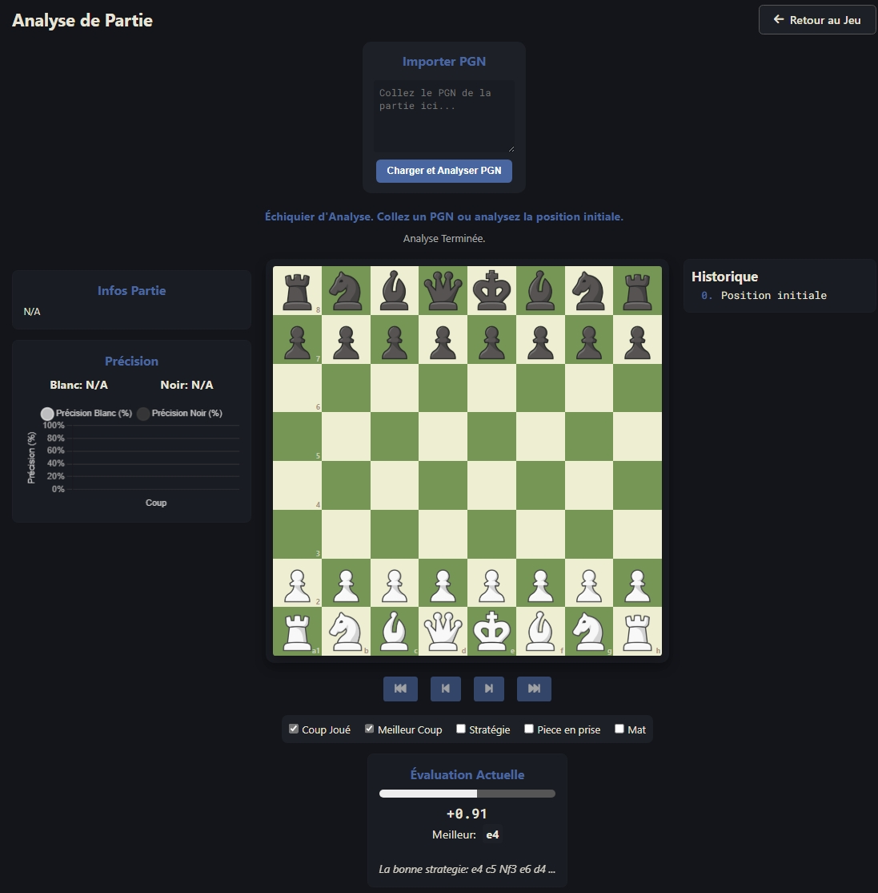
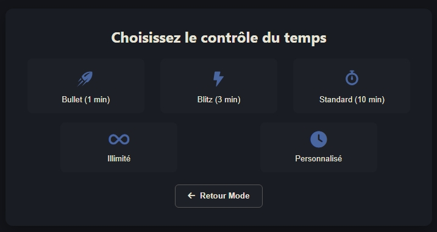
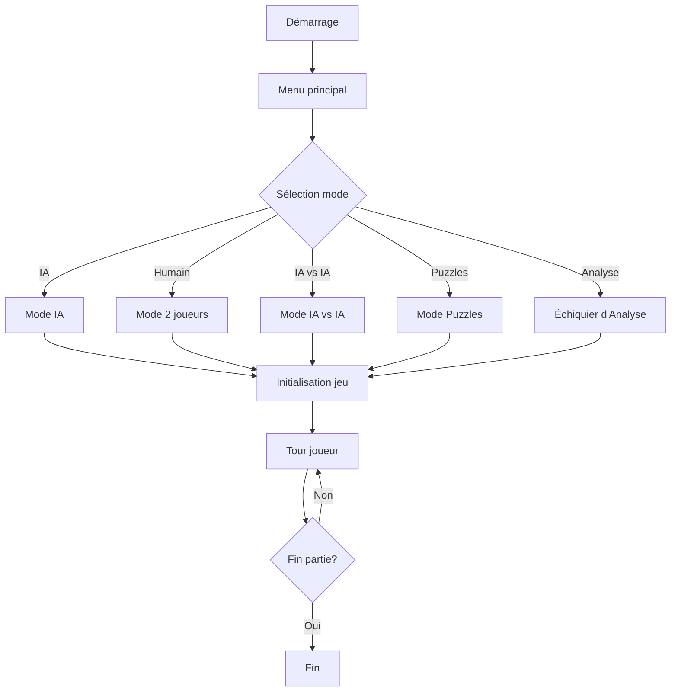

# DFWS Chess

**Échecs nouvelle génération avec IA compétitive** ♟️

DFWS Chess est un jeu d'échecs premium avec thème clair/sombre, développé avec HTML, CSS et JavaScript. Vous pouvez jouer contre une IA avec différents niveaux de difficulté ou contre un autre humain (en alternant les tours sur le même écran). Le jeu inclut un panneau de statistiques, un historique des mouvements et des minuteries pour les deux joueurs.

## Aperçu


*Menu principal du jeu DFWS Chess*


*Échiquier avec interface moderne et animations fluides*


*Sélection du niveau de l'IA*


*Échiquier en mode analyse*


*Menu des options*


*Affichage des minuteries*


*Menu affiché en fin de partie*

## Fonctionnalités

- **Thèmes clair et sombre** : Basculez entre une interface élégante sombre ou claire
- **Interface moderne et réactive** : Animations fluides et retours visuels
- **Modes de jeu** :
    - Jouer contre une IA avec des niveaux de difficulté ajustables
    - Jouer contre un autre humain sur le même appareil
    - Mode IA vs IA pour observer des parties simulées
    - Mode Puzzles pour résoudre des défis d'échecs
    - Échiquier d'analyse pour expérimenter des positions
- **Statistiques en temps réel** : Captures, mouvements et minuteries
- **Historique des coups** : Consultez tous les mouvements joués
- **Retours visuels améliorés** : Mise en surbrillance des mouvements possibles
- **Sons immersifs** : Effets sonores pour les actions du jeu
- **Notifications** : Système de toasts pour les événements importants
- **Support multilingue** : Interface en français
- **Puzzles d'échecs** : Résolvez des puzzles pour améliorer vos compétences
- **Mode d'apprentissage** : Apprenez les bases et stratégies avancées des échecs
- **Analyse en direct** : Obtenez des suggestions et des scores en temps réel dans le mode d'analyse
- **Graphique de précision** : Visualisez la précision des coups joués

## 🚀 Technologies Utilisées
- **Moteur d'échecs**: Stockfish 15 (WASM)
- **IA Adaptive**: Algorithmes Monte Carlo Tree Search optimisés
- **Frontend**: Web Components + Canvas 2D/WebGL
- **Performance**: Web Workers pour le calcul parallèle
- **Analytique**: TensorFlow.js pour l'analyse des parties

## Comment jouer

1. Ouvrez le fichier `index.html` dans votre navigateur
2. Sélectionnez votre mode dans le menu principal
3. Pour le mode IA, choisissez le niveau de difficulté
4. Jouez en cliquant sur les pièces
5. Suivez les statistiques en temps réel
6. Basculez entre les thèmes via le bouton dédié
7. La partie se termine par mat ou minuterie expirée

## 📦 Prérequis
```bash
Node.js 18+
Navigateur moderne (Chrome 120+ / Firefox 115+)
```

## Installation

```bash
git clone https://github.com/dualsfwshield/chess-with-ai.git
cd chess-with-ai
```

## 🔧 Installation Avancée
```bash
git clone https://github.com/dualsfwshield/chess-with-ai.git
cd chess-with-ai
npm install
npm run build
npm start
```

## Structure du projet
```
├── index.html          # Interface principale
├── styles-v2.css       # Styles et thèmes
├── scripts-v3.js       # Logique du jeu
├── puzzles.json        # Puzzles d'échecs
├── learn.js            # Mode d'apprentissage
├── assets/             # Ressources (images, etc.)
├── pieces/             # Images des pièces
├── sounds/             # Effets sonores
├── ai/                 # Cœur de l'IA
│   ├── engine.js       # Moteur Stockfish wrapper
│   └── mcts.js         # Algorithme de recherche
├── lib/                # Dépendances tierces
└── tests/              # Suite de tests Jest
```

## Diagramme de flux



## 🌟 Fonctions Avancées (Nouveau)
- **Benchmark IA**: 15k nœuds/sec en WebAssembly
- **Ouvertures**: Base de données de 10k ouvertures standard
- **API REST**: Endpoints pour intégration externe
- **PGN Support**: Import/Export de parties au format standard

## 🛠️ Contribuer
1. Forkez le dépôt
2. Créez une branche (`git checkout -b feature/amazing-feature`)
3. Commitez vos changements (`git commit -m 'Add amazing feature'`)
4. Pushez (`git push origin feature/amazing-feature`)
5. Ouvrez une Pull Request

## 📅 Roadmap
- [x] Moteur IA v1 (2023 Q4)
- [ ] Multiplayer en ligne (2024 Q1)
- [ ] App mobile React Native (2024 Q2)
- [ ] Module Python pour l'analyse (2024 Q3)

## 📜 License
Distribué sous licence MIT. Voir `LICENSE` pour plus d'informations.

## 📞 Support
Problème technique ? [Ouvrez un ticket](https://github.com/dualsfwshield/chess-with-ai/issues)

## Crédits
Développé par DFWS